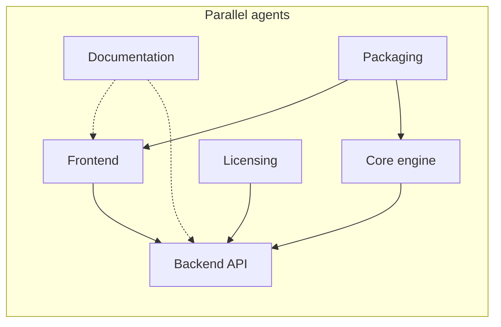

# Chakshu Forensics — Multi-Agent Work Guide

Use this file when starting a **new Cursor agent chat** for a specific domain. Open a separate chat per domain, `@AGENTS.md`, and name the chat after the agent (e.g. "Frontend Agent", "Licensing Agent").

## How to run parallel agents

1. **One chat = one domain.** Do not mix frontend + licensing + docs in the same session unless the change is tiny and cross-cutting.
2. **One branch per agent.** Example: `agent/frontend-compare-layout`, `agent/docs-user-guide`, `agent/license-third-party`.
3. **Stay inside your paths** (see table below). If you need another domain, leave a note in the PR description — do not edit those files.
4. **Shared contracts** (do not change without coordination):
   - API base: `http://127.0.0.1:9450` — UI: `http://localhost:9451`
   - Session/filter/media-type semantics in `frontend/src/lib/mediaContext.js` ↔ `src/aive/api/session.py`
   - Filter domains: `image` | `video` | `both` in `src/aive/filters/catalog.py`
5. **Before merging:** each agent runs its smoke test (see per-agent section).



---

## Agent roster

| Agent | Owns | Do not touch |
|-------|------|--------------|
| **Frontend** | `frontend/` | `src/aive/` except reading API shapes |
| **Backend API** | `src/aive/api/` | `frontend/`, filter implementations |
| **Core engine** | `src/aive/filters/`, `forensics/`, `video/`, `tracking/`, `annotations/`, `export/`, etc. | `frontend/`, route wiring unless adding endpoints |
| **Licensing** | `src/aive/license/`, `scripts/generate_license.py`, `LICENSE`, `THIRD_PARTY_NOTICES.md` | UI except license settings screen |
| **Documentation** | `docs/`, `README.md`, `FORENSIC-GUIDE.md`, `AUTHORS.md` | Application logic |
| **Packaging** | `desktop/`, `packaging/`, `build/`, `Dockerfile`, `docker-compose.yml`, `*.bat`, `Run-Chakshu.sh`, `scripts/install.sh` | Feature code unless build requires it |
| **Tests** | `tests/`, `docs/*TEST*`, `docs/*CHECKLIST*` | Refactors outside test scope |

---

## Frontend Agent

**Goal:** React UI (Vite), Examination Lab, Timeline Pro, Markup Studio, compare views, media-type-aware controls.

**Key files:**
- `frontend/src/ForensicApp.jsx` — main shell, routing, tool panels
- `frontend/src/components/` — panels, canvas, compare, timeline
- `frontend/src/styles/` — `forensic.css`, `compare.css`, `timeline.css`
- `frontend/src/lib/mediaContext.js` — filter/tool scoping by evidence type

**Conventions:**
- Use existing `fx-*` CSS classes; avoid inline styles except small one-offs
- Image compare: dock uses `.fx-compare-dock`; lab uses `.fx-compare-lab`
- Markup canvas must share wrapper with image (`.fx-markup-frame`) for correct cursor coords

**Smoke test:**
```bash
cd frontend && npm run dev
# Open http://localhost:9451 — ingest image, check compare + markup draw at cursor
```

**Known backlog:**
- Compare dock: Original vs Enhanced should dominate panel (~75% width)
- Media-type gates for all Examination Lab tool groups
- Timeline Pro layout polish

---

## Backend API Agent

**Goal:** FastAPI routes, session lifecycle, filter apply/preview, forensics endpoints.

**Key files:**
- `src/aive/api/server.py` — app entry, `/api/filters`
- `src/aive/api/session.py` — `SessionManager`, media type, filter allowlist
- `src/aive/api/routes_*.py` — domain routes

**Conventions:**
- Reject incompatible filter domains with clear 400 messages
- Keep OpenAPI at `/docs` accurate

**Smoke test:**
```bash
source .venv/bin/activate && export PYTHONPATH=src
python -m aive.api.server
# curl http://127.0.0.1:9450/api/filters
```

---

## Core Engine Agent

**Goal:** Filters, video pipeline, forensics algorithms, annotations backend, export, GPU.

**Key paths:** `src/aive/filters/`, `forensics/`, `video/`, `tracking/`, `annotations/`, `redaction/`, `measurement/`, `export/`

**Conventions:**
- Register new filters in `catalog.py` with correct `FilterDomain`
- Prefer extending existing filter base classes

**Smoke test:** `pytest tests/` for affected modules

---

## Licensing Agent

**Goal:** Proprietary license enforcement, key generation, trial flow, legal notices, dependency attribution.

**Current state:**
- `pyproject.toml`: `license = { text = "Proprietary" }`
- Implementation: `src/aive/license/protection.py` (machine fingerprint, Fernet keys, trial)
- Generator: `scripts/generate_license.py`
- **Missing:** root `LICENSE`, `THIRD_PARTY_NOTICES.md`, user-facing activation docs

**Tasks (suggested):**
1. Add `LICENSE` (proprietary text — coordinate with legal owner)
2. Generate `THIRD_PARTY_NOTICES.md` from `requirements*.txt` + `frontend/package.json`
3. Document activation flow in `docs/LICENSE-AND-ACTIVATION.md`
4. Wire API endpoint for license status if not exposed
5. Settings UI hook in frontend (coordinate with Frontend agent)

**Do not:** weaken validation or expose the signing secret in the repo.

**Smoke test:**
```bash
python scripts/generate_license.py --help
python -c "from aive.license.protection import machine_fingerprint, check_license; print(machine_fingerprint())"
```

---

## Documentation Agent

**Goal:** Accurate, navigable docs for examiners, installers, and developers.

**Key files:**
- `README.md` — quick start (React + API ports)
- `docs/ARCHITECTURE.md` — system map
- `docs/REQUIREMENTS-COMPLIANCE.md` — compliance matrix
- Phase docs `docs/PHASE-*.md`
- Platform guides: `WINDOWS-*.md`, `MAC-DOCKER-AND-WINDOWS.md`

**Conventions:**
- Keep ports consistent: API **9450**, UI **9451**
- Link between README ↔ docs/ ↔ FORENSIC-GUIDE.md
- Mark stale sections with `> **Note:**` rather than deleting history

**Tasks (suggested):**
1. Add `docs/INDEX.md` — single entry point
2. User workflow guide: ingest → examine → markup → export → chain of custody
3. API overview pointing to OpenAPI `/docs`
4. Refresh `COMPLIANCE-SUMMARY.md` against current features

**Smoke test:** Read-through + verify all command blocks match `Run-Chakshu.sh` / `scripts/install.sh`

---

## Packaging Agent

**Goal:** Docker, Windows portable, Electron desktop, install scripts.

**Key paths:** `desktop/`, `packaging/`, `build/`, `Dockerfile`, `docker-compose.yml`, `Build-*.bat`, `scripts/`

**Smoke test:** `./Run-Chakshu.sh` or `docker compose up --build`

---

## Tests Agent

**Goal:** Expand `tests/`, keep checklists in `docs/REQUIREMENTS-TEST-*` aligned.

**Smoke test:** `pytest tests/ -q`

---

## Starting a new agent chat (copy-paste prompts)

**Frontend:**
> You are the Frontend Agent for Chakshu Forensics. Read @AGENTS.md and @.cursor/rules/frontend.mdc. Work only in `frontend/`. Task: [describe task].

**Licensing:**
> You are the Licensing Agent. Read @AGENTS.md and @.cursor/rules/licensing.mdc. Work in `src/aive/license/`, `scripts/generate_license.py`, and create/update LICENSE and THIRD_PARTY_NOTICES. Task: [describe task].

**Documentation:**
> You are the Documentation Agent. Read @AGENTS.md and @.cursor/rules/documentation.mdc. Work in `docs/` and root markdown. Do not change application code. Task: [describe task].

---

## Merge order (when stacking PRs)

1. Core engine / API (contracts)
2. Frontend (consumes API)
3. Licensing / Packaging
4. Documentation (last — reflects shipped behavior)
