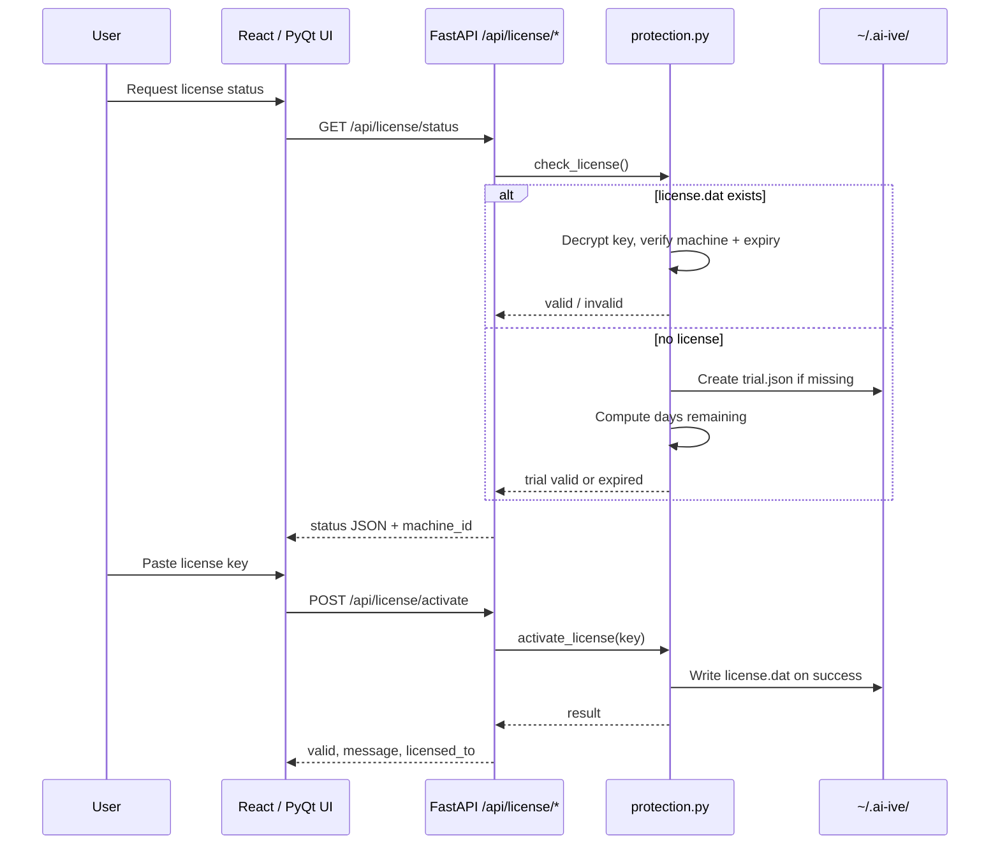

# License and Activation Guide

For **examiners**, **IT deployers**, and **support staff** running Chakshu
Forensics (AI-IVE) on forensic workstations.

Related files: [LICENSE](../LICENSE) (proprietary terms, draft), [THIRD_PARTY_NOTICES.md](../THIRD_PARTY_NOTICES.md).

---

## Overview

Chakshu Forensics uses **machine-bound activation**:

1. Each workstation has a unique **machine fingerprint** (32-character hex ID).
2. The vendor generates a **license key** tied to that fingerprint.
3. The user **activates** the key once; it is stored locally for future sessions.
4. If no valid license is present, the product runs in a **14-day trial** (configurable in `config/app.yaml`).

License data is stored under the user's home directory:

| File | Purpose |
|------|---------|
| `~/.ai-ive/license.dat` | Activated license key (encrypted token) |
| `~/.ai-ive/trial.json` | Trial start timestamp and machine ID |

---

## How activation works (technical flow)



### Machine fingerprint

Computed in `src/aive/license/protection.py` → `machine_fingerprint()`:

- Hostname, CPU architecture, processor string, MAC-derived node ID
- On Windows: `HKLM\SOFTWARE\Microsoft\Cryptography\MachineGuid` when available
- SHA-256 hash, first 32 hex characters (uppercase)

**Important:** Reinstalling OS, changing hostname, or replacing network hardware may change the fingerprint and invalidate existing keys. IT should capture the fingerprint from the **target examination machine** before requesting a key.

### License key format (vendor-generated)

Generated by `scripts/generate_license.py` (vendor-side only):

1. Build JSON payload: `machine_id`, `licensed_to`, `issued`, optional `expires`
2. Derive Fernet key via PBKDF2-HMAC-SHA256 (120k iterations) from vendor secret + salt
3. Encrypt payload; encode as URL-safe base64 (`salt + ciphertext`)

The vendor **signing secret** must be set via environment variable `AIVE_LICENSE_SECRET` in production. **Never commit production secrets to the repository.**

### Trial mode

- Default: **14 days** from first run (`trial_days` in `config/app.yaml`)
- Trial file is created on first `check_license()` when no valid `license.dat` exists
- After trial expiry, `check_license()` returns `valid: false` with message *"Trial expired. Please activate a license."*

### Validation on startup

| Entry point | Behavior |
|-------------|----------|
| **React + API** (`python -m aive.api.server`) | License endpoints available; **most API routes are not blocked** when trial expires (see gaps below) |
| **Legacy PyQt** (`python -m aive.main`) | Calls `check_license()`; shows warning dialog if invalid; app may still launch |

---

## Examiner workflow

### 1. Get your machine ID

**Option A — API (React stack running):**

```bash
curl -s http://127.0.0.1:9450/api/license/status | python3 -m json.tool
```

Note the `machine_id` field.

**Option B — Python one-liner:**

```bash
source .venv/bin/activate
export PYTHONPATH=src
python -c "from aive.license.protection import machine_fingerprint; print(machine_fingerprint())"
```

**Option C — Legacy PyQt:** Help → Machine ID (if using `aive.main`).

Send the machine ID to your vendor or IT license administrator.

### 2. Receive and activate a license key

**Option A — API:**

```bash
curl -s -X POST http://127.0.0.1:9450/api/license/activate \
  -H "Content-Type: application/json" \
  -d '{"license_key": "PASTE_KEY_HERE"}' | python3 -m json.tool
```

**Option B — Legacy PyQt:** Help → Activate License → paste key.

On success, `~/.ai-ive/license.dat` is written. Verify:

```bash
curl -s http://127.0.0.1:9450/api/license/status | python3 -m json.tool
```

Expect `"valid": true`, `"is_trial": false`, and `"licensed_to"` set to your organization or name.

### 3. Trial period

While in trial, status shows `"is_trial": true` and `"days_remaining"`. No key is required until the trial ends.

---

## IT / deployment checklist

| Step | Action |
|------|--------|
| 1 | Install Chakshu per [README](../README.md) on the examination workstation |
| 2 | Set `AIVE_LICENSE_SECRET` on **vendor key-generation hosts only** — not on examiner machines unless your deployment model requires client-side validation with a shared secret |
| 3 | Collect `machine_id` from each workstation |
| 4 | Generate keys with `python scripts/generate_license.py --machine-id <ID> --name "Agency Name" [--days 365]` |
| 5 | Deliver keys securely (not via public ticket systems) |
| 6 | Confirm activation via `GET /api/license/status` |
| 7 | Back up `~/.ai-ive/license.dat` if rebuilding the same machine image |

### Environment variables

| Variable | Used by | Purpose |
|----------|---------|---------|
| `AIVE_LICENSE_SECRET` | Key generation + validation | Must match between generator and runtime in production |

Default dev value `AI-IVE-DEV-SECRET-CHANGE-ME` is for local development only.

### Config (`config/app.yaml`)

```yaml
app:
  trial_days: 14
license:
  secret_env: AIVE_LICENSE_SECRET
  check_interval_hours: 24   # reserved — not wired in code yet
```

---

## Vendor key generation

Run on a **secure admin machine** with `PYTHONPATH=src` and production secret set:

```bash
export AIVE_LICENSE_SECRET="your-production-secret"
python scripts/generate_license.py \
  --machine-id "ABCD1234..." \
  --name "Example Forensics Lab" \
  --days 365
```

| Flag | Description |
|------|-------------|
| `--machine-id` | Target fingerprint (default: local machine — useful for testing) |
| `--name` | Licensee display name (`licensed_to`) |
| `--days` | Optional expiry; omit for non-expiring keys |
| `--secret` | Overrides env (avoid passing on command line in shared shells) |

---

## API reference

| Method | Path | Description |
|--------|------|-------------|
| `GET` | `/api/license/status` | Current license/trial state + `machine_id` |
| `POST` | `/api/license/activate` | Body: `{ "license_key": "..." }` |

**Status response fields:** `valid`, `message`, `licensed_to`, `is_trial`, `days_remaining`, `machine_id`

**Activate response fields:** `valid`, `message`, `licensed_to` (does not echo `expires` or `machine_id`)

OpenAPI: http://127.0.0.1:9450/docs

---

## Troubleshooting

| Symptom | Likely cause | Action |
|---------|--------------|--------|
| "License not valid for this machine" | Key issued for different fingerprint | Re-collect `machine_id` on this PC; request new key |
| "Invalid license key" | Wrong secret, corrupted key, or tampered file | Regenerate key; ensure production secret matches |
| "License expired" | `--days` elapsed | Request renewal key |
| "Trial expired" | 14+ days since first run | Activate license or reset trial only per vendor policy |
| Status OK but UI shows nothing | Main React app has no license panel yet | Use API or legacy UI; see Frontend agent backlog |

To remove activation (support / reinstall testing):

```bash
rm -f ~/.ai-ive/license.dat ~/.ai-ive/trial.json
```

---

## Gaps and coordination (other agents)

Documented for Backend, Frontend, and Packaging agents — **not implemented in this licensing pass**:

| Gap | Owner | Notes |
|-----|-------|-------|
| **No license gate on API routes** | Backend | `check_license()` is not middleware; expired trial can still call `/api/media/upload`, filters, export, etc. |
| **No license UI in ForensicApp** | Frontend | `ForensicApp.jsx` settings lack activation; legacy `App.jsx` only shows trial/active badge |
| **No `licenseActivate` in `client.js`** | Frontend | Add `POST /api/license/activate` helper + Settings panel |
| **`check_interval_hours` unused** | Backend | Config present; no periodic re-validation |
| **`expires` not in API responses** | Backend | Useful for IT renewal reminders |
| **Default dev secret in code** | Packaging | Production builds must inject `AIVE_LICENSE_SECRET`; never ship default in customer installers |
| **Desktop bundle** | Packaging | Ensure `~/.ai-ive` path works; document license file backup for golden images |
| **GPL dependency (pysrt)** | Legal / Packaging | See [THIRD_PARTY_NOTICES.md](../THIRD_PARTY_NOTICES.md) |

---

## Smoke test

```bash
python scripts/generate_license.py --help
python -c "from aive.license.protection import machine_fingerprint, check_license; print(machine_fingerprint()); print(check_license())"
curl -s http://127.0.0.1:9450/api/license/status
```
